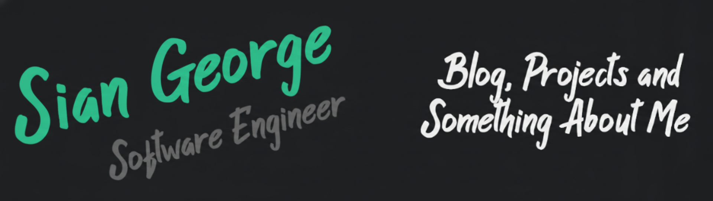

  

  
  
  

 

  

 

  

 

<table align="center" border="0" width="100%">
  <tr>
    <td width="50%" align="center" valign="top">
        
          
        
          
        

            <b>► CURRENT PROCESS:</b> B.Tech. in Computer Science and Engineering 
            <b>► INSTALLING:</b> React.js, Django REST, AI/Web Bridge 
            <b>► TARGETS:</b> EUPHORIA 2026 & ATHLEAD '25 Infrastructure 
            <b>► PHILOSOPHY:</b> "I once spent 4 hours automating a task that takes 5 minutes manually."
        

    </td>
    <td width="50%" align="center" valign="top">
       
        
       
    </td>
  </tr>
</table>

 

  

 

  

 

<table align="center" width="100%">
  <tr>
    <td width="25%" align="center">
      
      
<b>System Availability</b>

    </td>
    <td width="25%" align="center">
      
      
<b>Primary Objective</b>

    </td>
    <td width="25%" align="center">
      
      
<b>Skill Trajectory</b>

    </td>
    <td width="25%" align="center">
      
      
<b>Production Projects</b>

    </td>
  </tr>
</table>

 

  

 

<table align="center" width="100%">
  <tr>
    <td width="50%" valign="top">
      <h3>🎨 FRONTEND & UI/UX</h3>
      

        
        
        
      

      

        
        
        
      

      <h3>⚙️ BACKEND & CORE</h3>
      

        
        
        
      

      

        
        
      

    </td>
    <td width="50%" valign="top">
      <h3>💽 DATA & INFRASTRUCTURE</h3>
      

        
        
      

      

        
        
      

      <h3>🧩 INTERESTS & LEARNING</h3>
      

        
        
      

    </td>
  </tr>
</table>

 

  

 

<table align="center" width="100%">
  <tr>
    <td width="50%" valign="top">
      <h3>⚖️ <a href="https://github.com/SGcpu/we_hack_WHLG02">LEGALPATHSHALA</a></h3>
      
<b>MODULE:</b> Digital Awareness Platform

      
<b>STATUS:</b> 

      
A comprehensive platform bridging the gap between legal resources and common citizens.

      
<code>React</code> <code>Web Dev</code> <code>Hackathon</code>

    </td>
    <td width="50%" valign="top">
      <h3>🗳️ <a href="https://github.com/StudentCouncilCRCE/CRMD_25">CRMD '25</a></h3>
      
<b>MODULE:</b> Event Management System

      
<b>STATUS:</b> 

      
Official portal for the Student Council CRCE event, handling registration and information flow.

      
<code>Web</code> <code>Management</code> <code>Live</code>

    </td>
  </tr>
  <tr>
    <td width="50%" valign="top">
      <h3>🤫 <a href="https://github.com/SGcpu/Stifle_app">STIFLE APP</a></h3>
      
<b>MODULE:</b> Application Development

      
<b>STATUS:</b> 

      
Personal project module currently under active development.

      
<code>App Dev</code> <code>Experimental</code>

    </td>
    <td width="50%" valign="top">
      <h3>🤖 AUTOMATION SCRIPTS</h3>
      
<b>MODULE:</b> Productivity Tools

      
<b>STATUS:</b> 

      
Various Python scripts architected to handle chores and mundane tasks automatically.

      
<code>Python</code> <code>Scripting</code> <code>Automation</code>

    </td>
  </tr>
</table>

 

  

 

  <h2>💬 INITIATE COMMUNICATION</h2>
   
  
  
    

 

  

 

  

 

  
    
  

    
<strong>> Click to Decrypt Daily Quote</strong>

     
    
  

 

  

     
    

